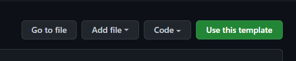
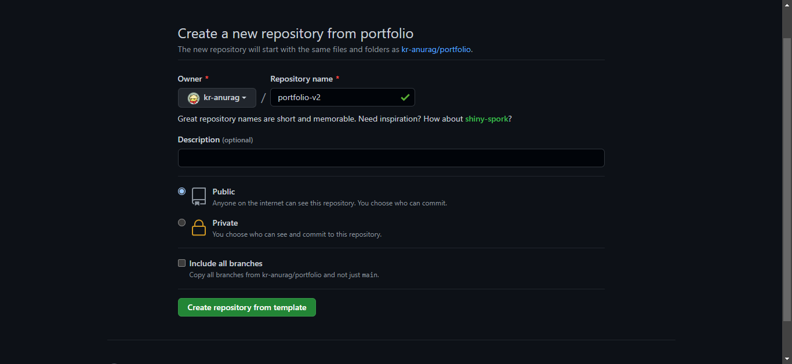
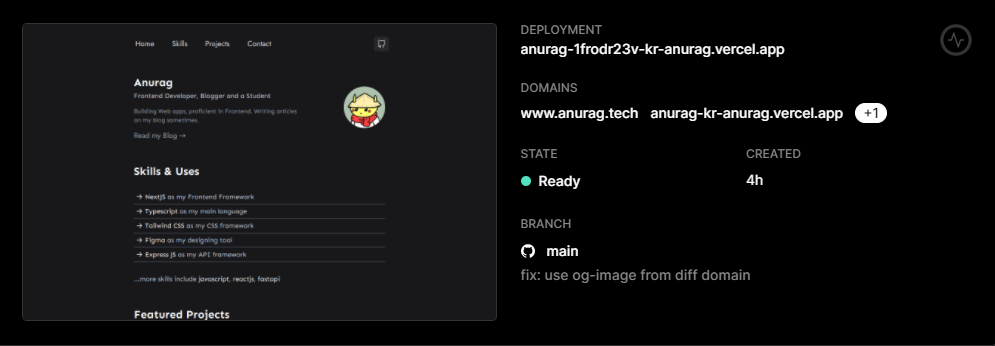

<h1>
    Welcome to my Portfolio
</h1>

> Note: This is a portfolio template, feel free to use it. And star it if you liked :P


✨ [Live Demo](https://mynextjsportfoliov3.netlify.app/)

### Using the template

### Using the Portfolio Template

First, clone this repo
```bash
git clone https://github.com/CodeLikeAGirl29/profile-nextjs-v3
```



Now choose a name for your repo and create.



### Running locally

- Install the dependencies

```
npm install # for npm
yarn install # for yarn
```

- Start the server

```
npm run dev # for npm
yarn dev # for yarn
```

## Making changes

To add your details go to the data.json file in the public folder and replace my data with yours.

To customize the colors go to `tailwind.config.js` and replace the existing colors with your brand colors.

After you have added all your data. Push the code to GitHub with these commands

```
git add .
git commit -m "your commit message"
git push
```

## Deploying

- Go to [Vercel](https://vercel.com/dashboard)
- Sign up for an account
- Click on New project
- Import your repository
- Click skip while creating a team and then hit deploy
- After it is deployed click on go to dashboard
- Your site is successfully deployed 🥳
- Now grab the URL and show it to world



### Bonus ⭐

This portfolio template contain a Spotify Card component [here](./components/Misc/Spotify.card.tsx) which shows the current streaming song on spotify.

**Example:**


To configure this, you need to add `env` vars to thr `.env.local` file in the following format:


```txt
SPOTIFY_CLIENT_ID=<your_client_id_here>
SPOTIFY_CLIENT_SECRET=<your_client_secret_here>
SPOTIFY_REFRESH_TOKEN=<your_refresh_token_here>
```

Read this [article](https://leerob.io/blog/spotify-api-nextjs) to get our own keys in this format.

And you're good to go!


### Author

😊 Lindsey K

- [Portfolio](https://lindseyk.dev)
- [Github](https://github.com/codelikeagirl29)
- [Twitter](https://twitter.com/dev_lindseyk)

---
